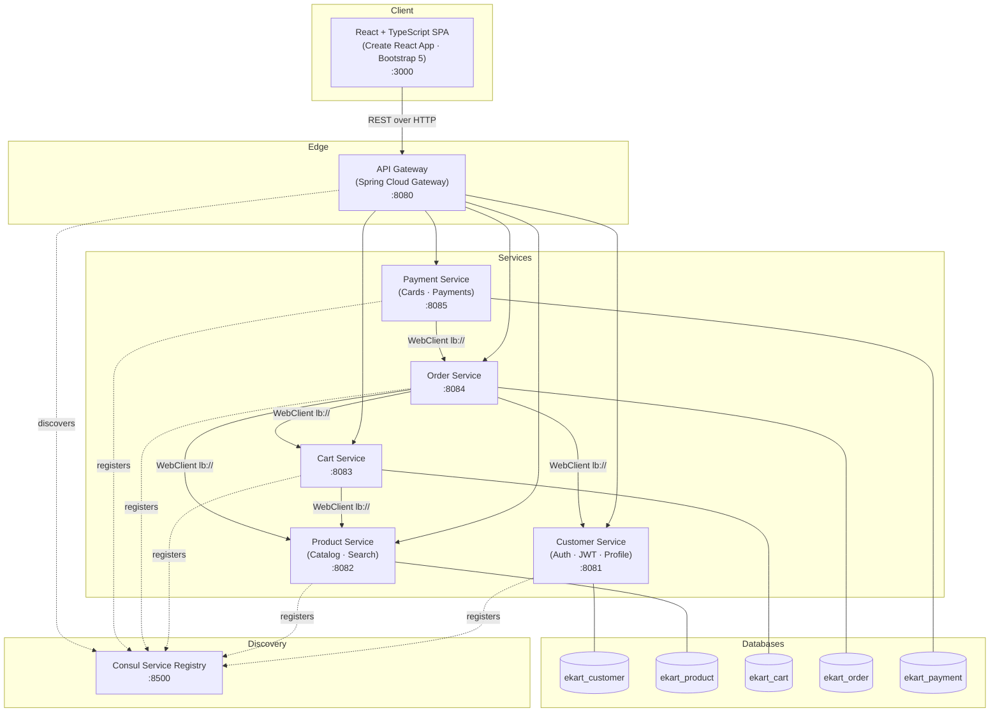

# EKart — Full-Stack Microservices E-Commerce Platform

EKart is a web-based e-commerce platform where customers register, browse products, manage a cart, place orders and pay by debit/credit card. The backend is a set of independent **Spring Boot microservices** (Spring Data JPA + Spring Web MVC), each owning its own **MySQL** schema, fronted by a **Spring Cloud Gateway**. Service registration and discovery use **Spring Cloud Consul**, and all inter-service communication is non-blocking via **reactive Spring `WebClient`** (`Mono`/`Flux`) with Consul-backed client-side load balancing. The frontend is a polished **React + TypeScript (Create React App)** single-page app styled with **Bootstrap 5 + custom CSS3**.

> This project re-implements the original Angular reference frontend as **React + TypeScript** while preserving the documented page structure, routing and REST API contracts.

---

## Architecture



### How a purchase flows

1. **Customer Service** authenticates the user and issues a **JWT**. The frontend stores it and sends it as `Authorization: Bearer <token>` through the gateway.
2. **Product Service** serves the catalog and case-insensitive name/brand search.
3. **Cart Service** keeps a per-customer cart, validating products against **Product Service** through a reactive load-balanced `WebClient`.
4. **Order Service** reads the cart, computes the total and discount (**10% credit / 5% debit**), snapshots line items, reduces inventory in **Product Service**, clears the cart, and creates an order in `PENDING_PAYMENT`. All three downstream calls go through reactive `WebClient`.
5. **Payment Service** validates the card + CVV (CVV is **BCrypt-hashed**, never stored in clear text), records the payment, and asks **Order Service** to mark the order `CONFIRMED`.

---

## Key design decisions

- **Service discovery — Consul.** Every microservice and the gateway register with Consul on startup (`spring-cloud-starter-consul-discovery`) and resolve peers through it. There is no Eureka anywhere.
- **Inter-service calls — reactive WebClient.** All synchronous-looking inter-service calls are implemented with non-blocking `WebClient` returning `Mono`/`Flux`, using the `lb://<service-name>` scheme so a `@LoadBalanced WebClient.Builder` resolves instances via Consul. There is no `RestTemplate` and no OpenFeign anywhere. Because the controller/JPA layer is classic blocking MVC, the reactive results are resolved at the service boundary.
- **Interface-first service layer.** Each service defines a service interface (e.g. `CartService`) with a separate implementation (`CartServiceImpl`). Controllers depend only on the interface.
- **Per-service `utility` package.** Each service has `utility/ErrorInfo.java` (error response shape), `utility/ExceptionControllerAdvice.java` (global `@RestControllerAdvice`) and `utility/LoggingAspect.java` (AOP request/response + timing logging), plus `log4j2.properties`, `messages.properties` and `ValidationMessages.properties` under `src/main/resources`. Logging runs on **Log4j2** (the default Logback starter is excluded).

---

## Port map

| Component            | Service name (Consul) | Port  | Database          | Base path        |
|----------------------|-----------------------|-------|-------------------|------------------|
| Consul agent         | (external)            | 8500  | —                 | `/ui` (dashboard)|
| API Gateway          | `api-gateway`         | 8080  | —                 | (all `/*-api/**`)|
| Customer Service     | `customer-service`    | 8081  | `ekart_customer`  | `/customer-api`  |
| Product Service      | `product-service`     | 8082  | `ekart_product`   | `/product-api`   |
| Cart Service         | `cart-service`        | 8083  | `ekart_cart`      | `/cart-api`      |
| Order Service        | `order-service`       | 8084  | `ekart_order`     | `/order-api`     |
| Payment Service      | `payment-service`     | 8085  | `ekart_payment`   | `/payment-api`   |
| Frontend (CRA dev)   | —                     | 3000  | —                 | —                |

The frontend talks **only** to the gateway (`http://localhost:8080`). CORS for `http://localhost:3000` is configured in both the gateway and the Customer Service security config.

---

## Prerequisites

- **JDK 21**
- **Maven 3.9+** (or use the bundled `mvnw` wrapper if present)
- **MySQL 8.x** running on `localhost:3306`
- **Consul** (any recent version) running on `localhost:8500`
- **Node.js 18+** and **npm**

The sample configs assume MySQL user `root` / password `root123`. Change them in each service's `src/main/resources/application.yml` (an `application-example.yml` documents every property).

### Starting Consul

Consul is an external dependency you run once. The quickest options:

```bash
# Option A — Docker
docker run -d --name consul -p 8500:8500 hashicorp/consul agent -dev -client=0.0.0.0

# Option B — local binary (after installing consul)
consul agent -dev
```

The Consul UI is then available at <http://localhost:8500/ui> — registered services appear there once started.

---

## 1. Set up the databases

Each service owns its own schema (database-per-service). Run the scripts in `database/` — they create the schema **and** insert sample seed data:

```bash
mysql -u root -p < database/01_customer_schema.sql
mysql -u root -p < database/02_product_schema.sql
mysql -u root -p < database/03_cart_schema.sql
mysql -u root -p < database/04_order_schema.sql
mysql -u root -p < database/05_payment_schema.sql
```

> The services also use `ddl-auto: update`, so they will create/upgrade tables on first run even if you skip the scripts — but the scripts give you the **seed data** (sample products, a demo customer and a sample card).

**Demo credentials** (created by the seed scripts):

| Email                    | Password    |
|--------------------------|-------------|
| `john.doe@example.com`   | `Ekart@123` |
| `jane.smith@example.com` | `Ekart@123` |

A sample **credit card** for `john.doe@example.com` is seeded with CVV `123`.

---

## 2. Start the backend (run each service independently)

Make sure **Consul is running first** (see above). Then start each service in its own terminal — order doesn't strictly matter for Consul, but starting the gateway after the domain services it routes to is convenient:

```bash
cd api-gateway      && mvn spring-boot:run
cd customer-service && mvn spring-boot:run
cd product-service  && mvn spring-boot:run
cd cart-service     && mvn spring-boot:run
cd order-service    && mvn spring-boot:run
cd payment-service  && mvn spring-boot:run
```

- Consul UI: <http://localhost:8500/ui> — all services should appear and be **passing** their health checks.
- Gateway health: <http://localhost:8080/actuator/health>

To build a runnable jar instead of `spring-boot:run`:

```bash
cd customer-service && mvn clean package
java -jar target/customer-service-1.0.0.jar
```

---

## 3. Start the frontend

```bash
cd frontend
cp .env.example .env      # sets REACT_APP_API_BASE_URL=http://localhost:8080
npm install
npm start                 # http://localhost:3000
```

Build for production: `npm run build` (outputs to `build/`).

---

## Project structure

```
ekart/
├── api-gateway/            # Spring Cloud Gateway (single entry point + CORS), Consul-discovered routes
├── customer-service/       # Register, login, JWT, profile         (ekart_customer)
├── product-service/        # Product catalog + search              (ekart_product)
├── cart-service/           # Shopping cart (WebClient → product)   (ekart_cart)
├── order-service/          # Order placement + history (WebClient) (ekart_order)
├── payment-service/        # Cards + payments (BCrypt CVV)         (ekart_payment)
├── database/               # One SQL schema + seed script per service
└── frontend/               # React + TypeScript (Create React App) SPA
```

Every Spring Boot service follows the same package layout under `com.ekart.<domain>`:

```
entity/        JPA entities
repository/    Spring Data JpaRepository interfaces
service/       <Name>Service interface + <Name>ServiceImpl
controller/    @RestController REST endpoints
dto/           request/response DTOs
client/        reactive WebClient clients (caller services only)
config/        security / JWT / WebClient beans
exception/     EkartException
utility/       ErrorInfo, ExceptionControllerAdvice, LoggingAspect
```

and these resource files under `src/main/resources`: `application.yml`, `application-example.yml`, `log4j2.properties`, `messages.properties`, `ValidationMessages.properties`.

---

## REST API summary (through the gateway)

All paths below are relative to `http://localhost:8080`.

### Customer API — `/customer-api`
| Method | Path                       | Description            | Auth |
|--------|----------------------------|------------------------|------|
| POST   | `/register`                | Create an account      | No   |
| POST   | `/login`                   | Authenticate, get JWT  | No   |
| GET    | `/customer/{emailId}`      | Get profile            | JWT  |

### Product API — `/product-api`
| Method | Path                              | Description           |
|--------|-----------------------------------|-----------------------|
| GET    | `/products`                       | List all products     |
| GET    | `/product/{productId}`            | Get one product       |
| GET    | `/products/search?q=term`         | Case-insensitive search|
| PUT    | `/product/{productId}/reduce-stock` | Internal: reduce stock|

### Cart API — `/cart-api`
| Method | Path                                                 | Description          |
|--------|------------------------------------------------------|----------------------|
| POST   | `/products`                                          | Add product(s) to cart|
| GET    | `/customer/{emailId}/products`                       | Get cart products    |
| PUT    | `/customer/{emailId}/product/{productId}`            | Update quantity      |
| DELETE | `/customer/{emailId}/product/{productId}`            | Remove product       |

### Order API — `/order-api`
| Method | Path                                  | Description          |
|--------|---------------------------------------|----------------------|
| POST   | `/place-order`                        | Place order from cart|
| GET    | `/customer/{emailId}/orders`          | Order history        |
| GET    | `/order/{orderId}`                    | Internal: get order  |
| PUT    | `/order/{orderId}/confirm`            | Internal: confirm    |

### Payment API — `/payment-api`
| Method | Path                                          | Description       |
|--------|-----------------------------------------------|-------------------|
| POST   | `/customer/{emailId}/cards`                   | Add a card        |
| GET    | `/customer/{emailId}/card-type/{cardType}`    | List cards        |
| POST   | `/customer/{emailId}/order/{orderId}`         | Make a payment    |

---

## Frontend routes

| Route                  | Page                | Notes                          |
|------------------------|---------------------|--------------------------------|
| `/login`               | Login               | Public                         |
| `/register`            | Register            | Public, full validation        |
| `/`                    | Home                | Protected, hero + featured     |
| `/products`            | Products            | Grid + live search suggestions |
| `/products/:productId` | Product details     | Quantity + Add to Cart         |
| `/cart`                | Cart                | Update qty, delete, subtotal   |
| `/place-order`         | Checkout            | Card → confirm → CVV → pay     |
| `/orders`              | My Orders           | Order history                  |
| `/cards`               | My Cards            | Add/list cards                 |
| `/profile`             | My Details          | Customer profile               |

State is managed with **React Context + `useReducer`** (`AuthContext`, `CartContext`, `ToastContext`). API calls go through a single **Axios** instance that attaches the JWT and normalises error messages. The API base URL comes from `REACT_APP_API_BASE_URL`. Every API shape is strongly typed in `src/types` — there is no `any` in the codebase.

---

## Security notes

- Passwords and card CVVs are hashed with **BCrypt**; raw CVVs are never stored.
- The Customer Service issues HMAC-signed JWTs. Override the secret in production via the `EKART_JWT_SECRET` environment variable.
- The seeded demo secrets/passwords are for local development only — rotate them before any real deployment.

---

## Tech stack

**Backend:** Java 21, Spring Boot 3.3, Spring Web MVC, Spring Data JPA (Hibernate), Spring Security, Spring Cloud Gateway, **Spring Cloud Consul** (discovery), **reactive WebClient + Spring Cloud LoadBalancer** (inter-service calls), Spring AOP, Log4j2, MySQL, jjwt.

**Frontend:** React 18, TypeScript, **Create React App (react-scripts 5)**, React Router v6, Axios, Bootstrap 5, custom CSS3.
